Title: RenderDoc架构解析与扩展指南
Date: 2025-11-20
Modified: 2025-12-16
Category: RenderDoc
Tags: RenderDoc
Slug: renderdoc-arch-dissect
Author: HaokunZheng
Summary: 本文章剖析了 RenderDoc 的核心架构、关键机制，并从Debug Overlay的实现角度深入探究了一下功能扩展

RenderDoc 作为一款开源的图形调试工具，凭借其强大的跨平台（Windows, Linux, Android, macOS）与跨 API（Vulkan, D3D11, D3D12, OpenGL, OpenGL ES）能力，在游戏开发与图形学研究领域扮演着至关重要的角色。它允许开发者捕获应用程序某一帧的全部图形 API 调用，并在一个隔离的环境中进行详尽的回放、检查与分析。理解其内部工作原理，不仅能帮助我们更高效地利用该工具，也为二次开发与功能扩展奠定了坚实基础。本文章将系统性地剖析 RenderDoc 的核心架构、关键机制与扩展方法。

## 整体架构概览

RenderDoc 的架构设计分离了 **捕获（Capture）** 与 **回放（Replay）** 两个核心环节。捕获端以轻量级、低侵入的方式在目标应用程序进程内注入钩子，记录图形 API 调用序列与相关资源；回放端则在一个独立的进程（如 RenderDoc UI 或命令行工具）中，加载捕获文件（.rdc），重建渲染状态，并提供丰富的调试与分析功能。

以下是 RenderDoc 的顶层架构图，它清晰地展示了从应用端到调试端的完整数据与控制流：

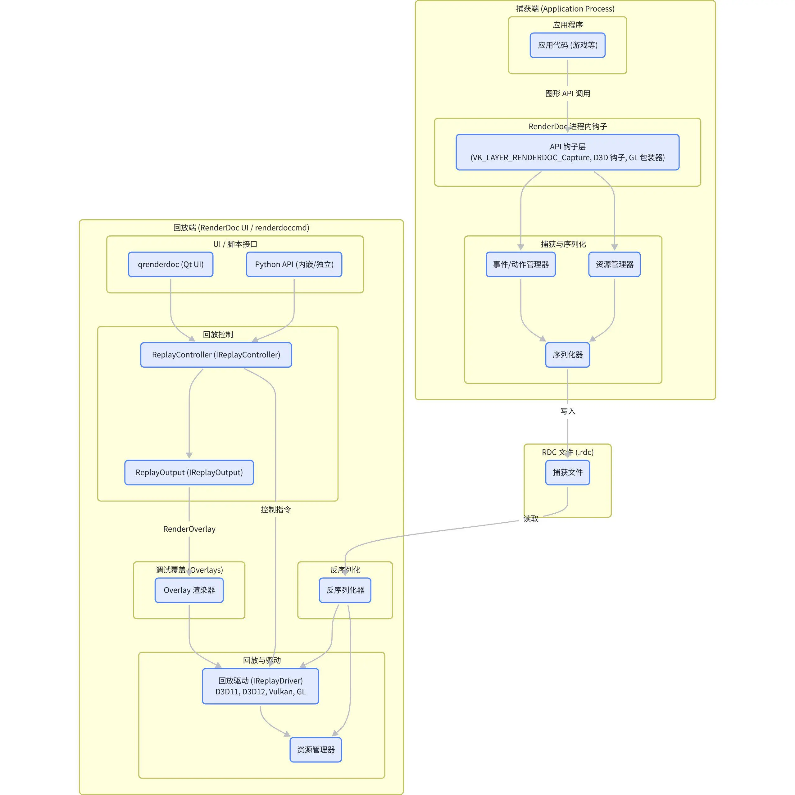

这幅图揭示了几个关键子系统：

- **捕获端** ：运行在目标应用进程中，通过 API 钩子（如 Vulkan 的 `VK_LAYER_RENDERDOC_Capture` 层或 D3D 的 `IDXGISwapChain` 代理）拦截所有图形命令。`EventManager` 负责将这些命令转化为内部事件，`ResourceManager` 跟踪 GPU 资源的生命周期与依赖，最终由 `Serialiser` 将所有信息高效地写入 `.rdc` 文件。
- **回放端** ：作为用户交互的主要界面，`qrenderdoc`（基于 Qt）或 `renderdoccmd`（命令行）负责加载 `.rdc` 文件。`ReplayController` 作为核心协调者，管理整个回放生命周期。它通过 `Deserialiser` 读取 `.rdc` 文件，并指令相应的 `ReplayDriver`（如 `D3D11Replay` 或 `VulkanReplay`）来重建资源和重放命令。
- **核心组件** ：
  - **ReplayOutput** ：负责将回放结果（如纹理、网格或 Overlay）呈现到窗口或导出为文件。
  - **Overlay体系** ：一个强大的可视化工具，能在回放的渲染结果之上叠加各类调试信息，如深度测试（Depth Test）、模板测试（Stencil Test）、线框模式（Wireframe）和四边形过绘制（Quad Overdraw）等。
  - **Python API** ：提供了强大的脚本化能力，允许开发者通过 Python 脚本与 RenderDoc 的核心功能交互，实现自动化分析与测试。

### 组件关系与交互

RenderDoc 的各个组件之间存在着清晰的依赖与协作关系。下图展示了核心组件之间的交互模式，有助于理解其模块化设计思想。

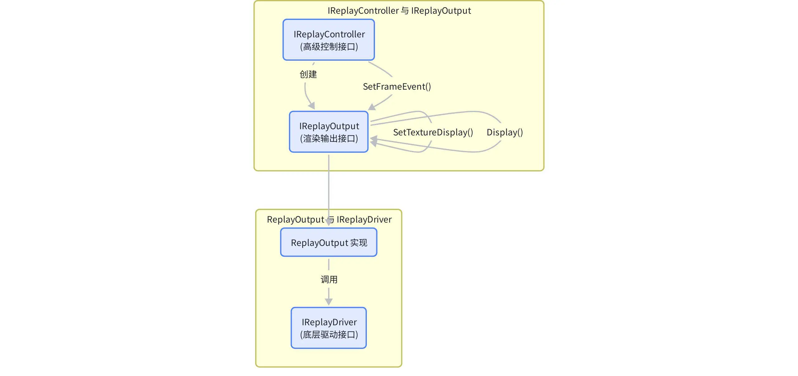

- **控制流** ：用户通过 UI 或脚本与 `IReplayController` 交互，例如请求跳转到某个特定事件（`EventID`）。`ReplayController` 接收指令后，会协调 `ReplayOutput` 和 `IReplayDriver` 来完成状态设置、命令重放和结果呈现。
- **数据流** ：`.rdc` 文件中的序列化数据被 `Deserialiser` 读取后，在 `IReplayDriver` 中被用于重建 GPU 资源和渲染管线。回放结果（如渲染目标纹理）或调试覆盖图（Overlay）最终在 `ReplayOutput` 中进行处理和展示。

### 仓库目录映射与关键文件

要深入理解 RenderDoc，首先需要熟悉其代码仓库的组织结构。RenderDoc 的源码遵循了清晰的模块化设计，将不同功能的代码划分到独立的目录中。本章将详细梳理 RenderDoc 的核心目录结构，并点名介绍其中的关键文件及其职责，为后续的代码分析和开发工作提供一份清晰的地图。

仓库顶层目录结构

RenderDoc 的代码库主要由几个顶层目录构成，分别承担着 UI、核心库、驱动后端和数据资源等不同职责。下图直观地展示了这一结构：

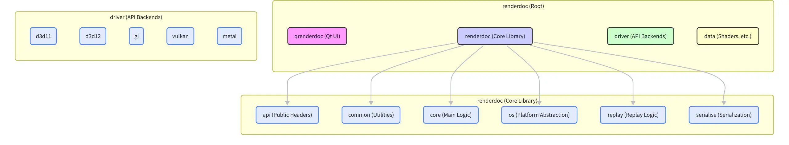

- `qrenderdoc` : 这是 RenderDoc 的图形用户界面（GUI）部分，基于 Qt 框架开发。它包含了所有窗口、控件、数据可视化以及与用户交互的逻辑。对于希望修改 UI 行为或添加新可视化功能的开发者来说，这是最主要的入口。
- `renderdoc` : 这是 RenderDoc 的核心库，包含了与具体图形 API 无关的所有核心逻辑，如捕获/回放控制、序列化、平台抽象和公共工具等。它是整个工具的心脏。
- `driver` : 此目录存放了所有与特定图形 API 相关的实现代码，即“驱动后端”。每个子目录（如 `vulkan`, `d3d11`, `gl`）都包含了对应 API 的捕获与回放逻辑。这是理解 RenderDoc 如何与具体 API 交互的关键。
- `data` : 包含了一些静态数据资源，如用于 Overlay 渲染的内置着色器（Shader）、字体文件和其他在运行时需要加载的资源。

### 核心目录与关键文件职责

下表详细列举了 RenderDoc 仓库中超过 15 个关键目录和文件的职责，这些是理解其工作流程和进行二次开发时最常接触的部分。

| 路径                                               | 类型 | 核心职责                                                                                                       |
| -------------------------------------------------- | ---- | -------------------------------------------------------------------------------------------------------------- |
| renderdoc/renderdoc/api/replay/                    | 目录 | 定义了 RenderDoc 的公共回放 API，是外部工具（包括 `qrenderdoc` 和 Python 脚本）与核心库交互的入口。          |
| renderdoc/renderdoc/api/replay/renderdoc_replay.h  | 文件 | （极其重要）定义了 `IReplayController` 和 `IReplayOutput` 两个核心接口，分别负责回放的总体控制和渲染输出。 |
| renderdoc/renderdoc/api/replay/replay_enums.h      | 文件 | 定义了大量的枚举类型，如 DebugOverlay、GraphicsAPI 等，是理解各种状态和选项的基础。                            |
| renderdoc/renderdoc/replay/                        | 目录 | 包含了回放逻辑的核心实现。                                                                                     |
| renderdoc/renderdoc/replay/replay_controller.cpp   | 文件 | `IReplayController` 接口的具体实现类 `ReplayController` 的所在地，处理所有高级回放指令。                   |
| renderdoc/renderdoc/replay/replay_output.cpp       | 文件 | IReplayOutput 接口的具体实现类 ReplayOutput 的所在地，负责管理渲染窗口、纹理显示和 Overlay 的刷新。            |
| renderdoc/renderdoc/replay/replay_driver.h         | 文件 | 定义了 `IReplayDriver` 接口，这是一个更底层的驱动抽象，由各 API 后端实现，负责执行具体的渲染命令。           |
| renderdoc/renderdoc/serialise/                     | 目录 | 负责所有数据的序列化与反序列化逻辑。                                                                           |
| renderdoc/renderdoc/serialise/serialiser.h         | 文件 | 定义了 Serialiser 模板类，是 RenderDoc 实现数据读写的核心工具，支持 Chunk 模式和版本控制。                     |
| renderdoc/renderdoc/api/replay/structured_data.h   | 文件 | 定义了结构化数据（Structured Data）的表示，如 `SDObject`、`SDChunk`，用于将 API 调用参数化并保存。         |
| renderdoc/renderdoc/driver/vulkan/                 | 目录 | Vulkan 后端的实现，包含了 Vulkan API 的捕获与回放逻辑。                                                        |
| renderdoc/renderdoc/driver/vulkan/vk_layer.cpp     | 文件 | 实现了 Vulkan 的捕获层（`VK_LAYER_RENDERDOC_Capture`），是 Vulkan API 调用的入口点。                         |
| renderdoc/renderdoc/driver/vulkan/vk_replay.cpp    | 文件 | 实现了 Vulkan 的回放逻辑，是 `IReplayDriver` 的 Vulkan 版本。                                                |
| renderdoc/renderdoc/driver/d3d11/d3d11_overlay.cpp | 文件 | D3D11 后端中 Overlay 渲染的具体实现，展示了如何生成深度、线框等覆盖图。                                        |
| renderdoc/qrenderdoc/                              | 目录 | Qt UI 的所有源码。                                                                                             |
| renderdoc/qrenderdoc/Code/CaptureContext.cpp       | 文件 | UI 层与 `IReplayController` 交互的桥梁，管理当前加载的捕获文件和回放状态。                                   |
| renderdoc/renderdoccmd/                            | 目录 | 命令行版本的 RenderDoc，提供无头（headless）的捕获与回放能力，适合自动化脚本。                                 |

### 关键文件之间的交互

理解这些文件如何协同工作是掌握 RenderDoc 架构的关键。下图展示了几个核心接口与实现类之间的调用关系：

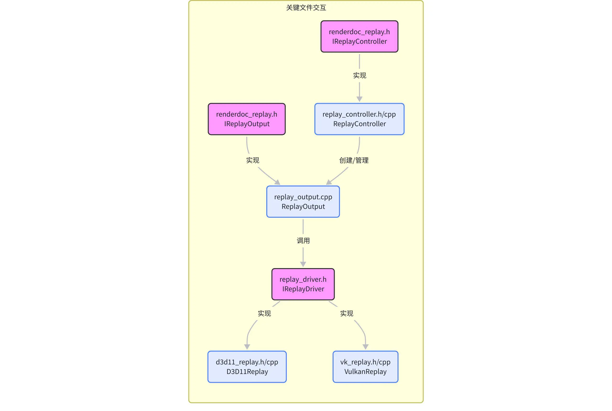

这个流程可以概括为：

- 高层控制 ：UI (`qrenderdoc`) 或 Python 脚本通过 `IReplayController` 接口发送指令，如“跳转到 EventID 1234”或“显示深度覆盖图”。
- 具体实现 ：`ReplayController` 类实现了这些指令。它会创建一个或多个 `ReplayOutput` 实例来管理渲染窗口。
- 渲染输出 ：`ReplayOutput` 负责具体的渲染任务。当需要显示纹理或 Overlay 时，它会调用 `IReplayDriver` 接口的相应方法。
- 驱动执行 ：`D3D11Replay` 或 `VulkanReplay` 等具体的驱动实现类，会执行底层的 API 调用来完成渲染，并将结果呈现出来。

通过对这些目录和文件的梳理，我们建立了一个清晰的知识框架。基于这个框架，深入到各个模块的实现细节中，探索 RenderDoc 如何实现其捕获与回放功能。

## 捕获机制详解

RenderDoc 的核心能力始于其精确而高效的捕获机制。捕获过程发生在目标应用程序的进程空间内，通过拦截图形 API 调用，将一帧内发生的所有渲染指令、资源创建与修改、状态变更等信息完整地记录下来。本章将深入探讨 RenderDoc 是如何针对不同的图形 API 实现注入与拦截，以及它如何将这些信息序列化为结构紧凑的 .rdc 文件。

### API 注入与调用拦截

RenderDoc 支持多种图形 API，每种 API 的注入（Injection）和钩子（Hooking）机制都略有不同，但核心思想都是在应用程序与原生图形驱动之间插入一个代理层。下图展示了主流 API 的捕获流程：

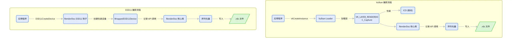

#### Vulkan: 通过 Layer 机制

Vulkan 从设计之初就提供了一套标准的层（Layer）机制，用于调试、验证和性能分析。RenderDoc 正是利用了这一点来实现 API 拦截。

- 注入方式 ：RenderDoc 通过设置环境变量 `VK_INSTANCE_LAYERS` 或在系统注册表中注册一个隐式层（Implicit Layer），将自己的捕获层 `VK_LAYER_RENDERDOC_Capture` 插入到 Vulkan 的调用链中。当应用程序创建 VkInstance 时，Vulkan 加载器（Loader）会自动加载这个层。
- 拦截实现 ：`vk_layer.cpp` 文件是 Vulkan 捕获层的核心。它通过 `vkGetInstanceProcAddr` 和 `vkGetDeviceProcAddr` 导出了一系列与原生 Vulkan 函数同名的“钩子函数”。例如，`hooked_vkCreateInstance` 会在真正的 `vkCreateInstance` 调用前后执行 RenderDoc 的初始化逻辑，并创建一个 WrappedVulkan 核心对象来管理捕获状态。

```c++
// renderdoc/renderdoc/driver/vulkan/vk_layer.cpp:283-291

VKAPI_ATTR VkResult VKAPI_CALL hooked_vkCreateInstance(const VkInstanceCreateInfo *pCreateInfo,
                                                       const VkAllocationCallbacks *,
                                                       VkInstance *pInstance)
{
  KeepLayerAlive();

  WrappedVulkan *core = new WrappedVulkan();
  return core->vkCreateInstance(pCreateInfo, NULL, pInstance);
}

```

这段代码展示了 `vkCreateInstance` 的钩子实现。它首先确保层在进程中保持活动，然后创建 WrappedVulkan 实例，该实例将接管后续所有的 Vulkan API 调用，进行记录和包装。

#### Direct3D: 通过代理 DLL 和接口包装

对于 D3D，RenderDoc 采用的是一种更传统的钩子技术——代理 DLL（Proxy DLL）。

- 注入方式 ：当用户通过 RenderDoc UI 启动一个程序时，RenderDoc 会将一个特制的 DLL（如 d3d11.dll）注入到目标进程中。这个 DLL 导出了与官方 d3d11.dll 相同的函数，如 `D3D11CreateDevice`。由于 Windows 的 DLL 搜索顺序，应用程序会优先加载 RenderDoc 的代理 DLL。
- 拦截实现 ：代理 DLL 中的 `D3D11CreateDevice` 函数被调用时，它首先会加载真正的系统 d3d11.dll，然后调用其 `D3D11CreateDevice` 来创建底层的 D3D 设备。接着，RenderDoc 会创建一个 `WrappedID3D11Device` 对象，该对象包装了原生的 `ID3D11Device` 接口。之后所有通过该设备进行的操作，都会先经过这个包装层，从而被记录下来。

#### OpenGL: 通过函数地址替换

OpenGL 的拦截方式与 D3D 类似，也是通过代理 `opengl32.dll`。关键在于 `wglGetProcAddress`，这个函数用于获取 OpenGL 扩展函数的地址。RenderDoc 的代理 `wglGetProcAddress` 会返回自己钩子函数的地址，而不是驱动原生函数的地址，从而实现对 OpenGL 调用的全面拦截。

### 事件记录与序列化

一旦 API 调用被拦截，RenderDoc 就需要将它们以及相关的资源和状态信息记录下来。这个过程的核心是 **事件（Event）** 和 **数据块（Chunk）** 。

- EventID : 每一帧中的每个 API 调用（特别是那些有显著影响的，如 Draw Call）都会被赋予一个唯一的 EventID。这个 ID 是一个简单的递增整数，它成为了整个捕获和回放过程中的核心时间戳。在回放时，我们可以通过 SetFrameEvent(eventId) 精确地跳转到任意一个 API 调用之后的状态
- Chunk : 每个被记录的 API 调用及其参数都被组织成一个“数据块”（Chunk）。每个 Chunk 都有一个唯一的 ID（ChunkID），用于标识其代表的操作类型（如 vkCmdDraw, D3D11Device::CreateBuffer 等）。
- **RDC 文件结构**

.rdc 文件本质上是一个由多个段（Section）组成的容器，其中最重要的就是 帧捕获段（Frame Capture Section） 。这个段包含了该帧内所有 API 调用的 Chunks 序列。下图描绘了 .rdc 文件的逻辑结构：

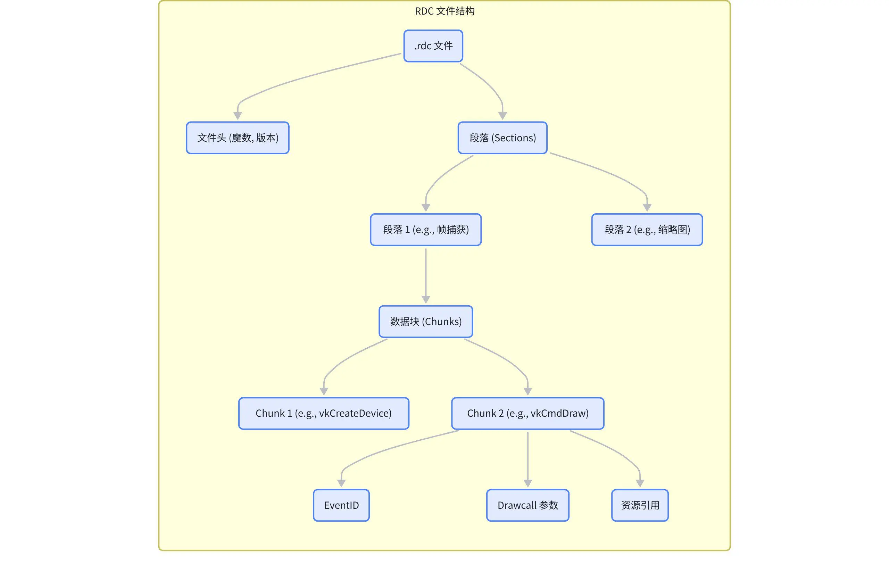

**序列化过程**：`Serialiser` 类是数据写入的核心。当一个 API 调用被捕获时，`WrappedVulkan` 或 `WrappedD3D11Device` 等包装对象会调用 `Serialiser` 的方法来开始一个新的 Chunk (`BeginChunk`)，然后将函数名、参数、资源 ID 等信息逐一序列化写入，最后结束该 Chunk (`EndChunk`)。资源（如纹理、缓冲区）的内容也会在需要时（如创建或修改时）被序列化为单独的数据块。

```C++
// renderdoc/renderdoc/replay/capture_file.cpp:480-492

SectionProperties frameCapture;
frameCapture.flags = SectionFlags::ZstdCompressed;
frameCapture.type = SectionType::FrameCapture;
frameCapture.name = ToStr(frameCapture.type);
frameCapture.version = file->version;

StreamWriter *writer = output.WriteSection(frameCapture);

WriteSerialiser ser(writer, Ownership::Nothing);

ser.WriteStructuredFile(*file, exportProgress);

writer->Finish();
```

这段代码展示了在没有现成帧捕获段时，如何通过 `WriteSerialiser` 将内存中的结构化数据（`SDFile`）写入到一个新的、经过 Zstd 压缩的帧捕获段中。这种基于 Chunk 的流式序列化设计，使得 `.rdc` 文件既结构清晰又易于扩展和版本管理。

通过这种精巧的捕获与序列化机制，RenderDoc 成功地将一帧之内瞬息万变的 GPU 状态凝固成一个可被反复探查的数字标本，为后续的深度分析提供了可能。

## 回放机制详解

捕获完成后，RenderDoc 的真正威力在于其强大的回放（Replay）系统。回放机制负责加载 `.rdc` 文件，在一个受控环境中精确地重建捕获帧的初始状态，并根据用户的指令重演（Replay）任意一段 API 调用序列。这使得开发者能够像使用视频播放器一样“拖动”时间轴，检查任意时刻的 GPU 状态。本章将详细解析 RenderDoc 的回放流程、核心组件的协作方式，以及调试覆盖图（Overlay）的生成过程。

### 回放核心流程

RenderDoc 的回放过程并非简单地从头到尾执行一遍所有 API 调用，而是一个高度灵活、按需执行的系统。其核心围绕 `EventID` 展开，允许精确跳转到任意事件点。以下时序图描述了一个典型的回放交互流程：从打开捕获文件到最终导出带有 Overlay 的纹理。

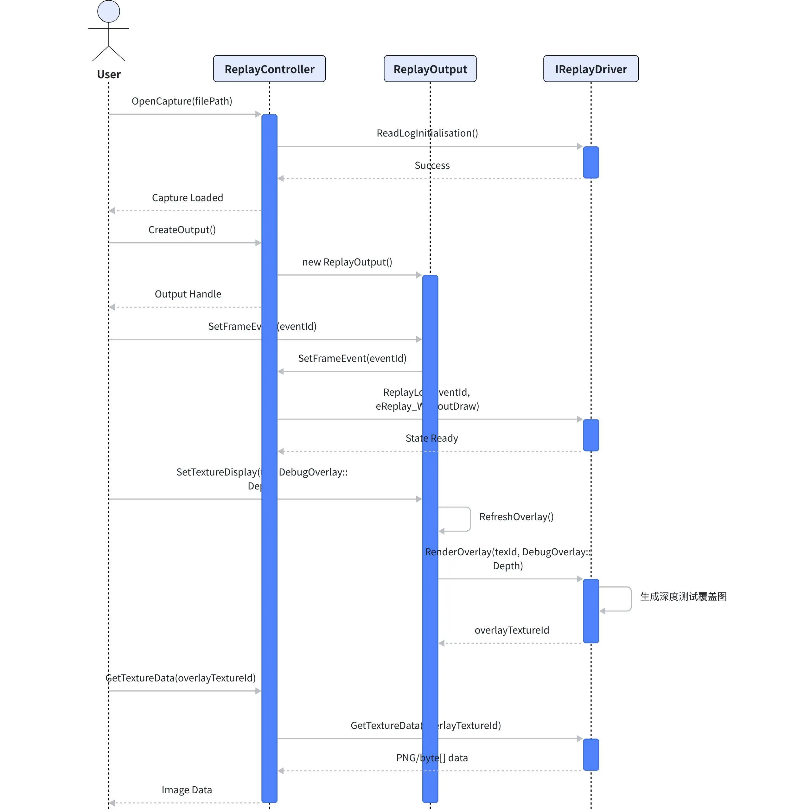

这个流程可以分解为以下几个关键步骤：

1. **打开捕获与初始化** ：用户通过 UI 或脚本请求打开一个 `.rdc` 文件。`ReplayController` 接管此请求，初始化一个对应的 `IReplayDriver`（如 `VulkanReplay`），并调用 `ReadLogInitialisation()`。在这一步，驱动会读取文件的元数据和初始资源状态，在 GPU 上创建所有必要的初始资源（纹理、缓冲区等），为后续的回放做好准备。
2. **设置事件点 (SetFrameEvent)** ：当用户在 UI 中点击某个 Draw Call 时，`ReplayController` 的 `SetFrameEvent(eventId)` 方法会被调用。这是回放机制的核心。驱动会从最近的检查点（或帧的开始）开始，重放所有直到 `eventId` 之前的 API 调用。为了优化性能，通常会采用 `eReplay_WithoutDraw` 模式，即只执行状态变更和资源更新命令，跳过实际的绘制和分发（Draw/Dispatch）调用。这使得状态跳转非常迅速。
3. **生成调试覆盖图 (RenderOverlay)** ：如果用户启用了某个 Overlay（如深度测试），`ReplayOutput` 在接收到 `SetTextureDisplay` 指令后，会调用其 `RefreshOverlay()` 方法。该方法是生成覆盖图的关键入口。

```C++
   // renderdoc/renderdoc/replay/replay_output.cpp:277-294

   if(m_Type == ReplayOutputType::Texture && m_RenderData.texDisplay.overlay != DebugOverlay::NoOverlay)
   {
     ResourceId id = m_pDevice->GetLiveID(m_RenderData.texDisplay.resourceId);

     if(id != ResourceId() && action && m_pDevice->IsRenderOutput(id))
     {
       FloatVector f = m_RenderData.texDisplay.backgroundColor;

       m_OverlayResourceId =
           m_pDevice->RenderOverlay(id, f, m_RenderData.texDisplay.overlay, m_EventID, passEvents);
       m_pController->FatalErrorCheck();
       m_OverlayDirty = false;
     }
     else
     {
       m_OverlayResourceId = ResourceId();
     }
   }
```

如代码所示，`RefreshOverlay` 会调用底层 `IReplayDriver` 的 `RenderOverlay` 方法。这个调用传递了当前要应用 Overlay 的目标纹理 ID、Overlay 类型（如 `DebugOverlay::Depth`）和当前事件 ID。驱动后端（如 `D3D11Replay`）会执行一系列特殊的渲染 pass 来生成覆盖图，并返回一个包含结果的新纹理 ID。

4.**最终呈现与导出** ：`ReplayOutput` 随后可能会调用 `ReplayLog(eReplay_OnlyDraw)` 来执行当前事件的实际绘制操作，并将其与生成的 Overlay 合成显示。如果用户需要导出图像，`GetTextureData` 会被调用，从 GPU 中取回指定纹理（无论是原始渲染结果还是 Overlay 纹理）的像素数据。

### 核心组件协作：Controller, Output, 和 Driver

RenderDoc 的回放系统由三个核心组件协同工作，各自职责分明：


- `IReplayController` /  `ReplayController` ：**高级指挥官** 。它负责管理整个回放会话的生命周期，包括加载/关闭捕获、创建/销毁 `ReplayOutput`、处理来自 UI 或脚本的高级指令（如 `SetFrameEvent`、查询管线状态 `GetPipelineState`、获取资源列表 `GetTextures` 等）。它不关心具体的渲染细节，只负责协调和分发任务。
- `IReplayOutput` / `ReplayOutput`： **渲染目标与展示器** 。每个 `ReplayOutput` 对应一个渲染窗口或一个离屏渲染目标。它负责管理最终图像的呈现，包括要显示的纹理、应用的 Overlay 类型、缩放/平移等视觉参数。它将高层的显示需求转化为对底层驱动的调用。
- `IReplayDriver`/ (e.g.,`VulkanReplay`,`D3D11Replay`)： **底层执行者** 。这是与具体图形 API 直接交互的层。它实现了所有底层的回放逻辑，包括创建和管理 GPU 资源、根据 Chunk 重建 API 调用、执行渲染命令、以及实现各种 `RenderOverlay` 的具体算法。它是真正“干活”的角色。

这种分层设计带来了极大的灵活性和可扩展性：

- **解耦** ：UI 层和核心控制逻辑与具体的图形 API 实现完全解耦。添加对新 API 的支持，只需要实现一个新的 `IReplayDriver` 即可，而无需改动上层代码。
- **多输出** ：一个 `ReplayController` 可以管理多个 `ReplayOutput`，例如，主窗口显示最终渲染结果，而多个小窗口可以同时显示不同的 G-Buffer 纹理或历史版本的缩略图。
- **清晰的职责** ：`Controller` 负责“做什么”，`Output` 负责“怎么看”，而 `Driver` 负责“怎么干”，使得代码结构清晰，易于维护和扩展。

通过这套精心设计的回放机制，RenderDoc 不仅能忠实地重现捕获的每一帧，还能在此基础上提供强大的交互式分析能力，成为图形开发者手中不可或缺的利器。

## 序列化到 rdc 的数据结构与流程

`.rdc` 文件是 RenderDoc 的基石，它持久化地存储了图形应用一帧内的所有活动。要理解 RenderDoc 的工作原理，就必须理解其序列化（Serialization）机制。RenderDoc 设计了一套强大而灵活的序列化框架，不仅能高效地读写数据，还支持版本管理、数据自省和懒加载（Lazy Loading）。本章将深入剖析其核心组件 `Serialiser` 和结构化数据（Structured Data）体系，揭示 API 调用是如何被编码成二进制数据流的。

### 核心组件

RenderDoc 的序列化有两个核心概念：

1. **`Serialiser`** : 这是一个模板类，位于 `renderdoc/serialise/serialiser.h`，是所有读写操作的执行者。它提供了 `Read` 和 `Write` 的底层接口，并围绕着“数据块”（Chunk）的概念进行组织。它有两个主要的派生类：`ReadSerialiser` 和 `WriteSerialiser`，分别用于读和写。
2. **Structured Data (SD)** : 这是一套用于描述和存储任意数据的自省系统，定义在 `renderdoc/api/replay/structured_data.h`。它允许 RenderDoc 将 C++ 的结构体、枚举、数组等数据结构，连同其类型信息（元数据）一起保存。核心类包括 `SDObject`、`SDType` 和 `SDChunk`。

### Serialiser 的 Chunk 模式

`Serialiser` 通过 `BeginChunk` 和 `EndChunk` 方法来组织数据流。每个 Chunk 都有一个 `ChunkID` 和一个长度，形成了一个层级化的数据结构。这种模式带来了几个好处：

- **可读性与健壮性** ：在读取时，如果遇到不认识的 `ChunkID`，可以直接根据长度跳过整个 Chunk，保证了向前和向后的兼容性。
- **版本控制** ：`Serialiser` 包含版本号。开发者可以在序列化代码中根据版本号判断，来处理不同版本的数据结构差异。
- **易于调试** ：由于数据是分块的，调试和分析 `.rdc` 文件变得更加容易。

以下是 `Serialiser` 中关于 Chunk 操作的核心接口：

```C++
// renderdoc/renderdoc/serialise/serialiser.h:212-213

uint32_t BeginChunk(uint32_t chunkID, uint64_t byteLength);
void EndChunk();
```

在捕获时，每个被拦截的 API 调用都会被包装在一个 Chunk 中。`ChunkID` 通常对应一个内部枚举，唯一标识了该 API 调用（如 `VulkanChunk::vkCmdDraw`）。Chunk 的内容则是该调用的所有参数，它们被 `Serialiser` 逐一写入。

### 结构化数据 (Structured Data) 体系

为了能够以一种通用的方式表示和存储各种 API 的参数，RenderDoc 设计了 `StructuredData` 体系。它类似于一个微型的反射系统，能够描述数据的类型、名称和值。

- **`SDObject`** : 表示一个数据实例，可以是基本类型（如整数、浮点数）、字符串、数组或结构体。
- **`SDType`** : 描述 `SDObject` 的类型信息，包括其基类型（`SDBasic`）、名称和大小。
- **`SDChunk`** : 继承自 `SDObject`，是顶层的结构化数据容器，每个 `SDChunk` 对应序列化流中的一个物理 Chunk，并附带了元数据 `SDChunkMetaData`（如时间戳、持续时间等）。

```C++
// renderdoc/renderdoc/api/replay/structured_data.h:1453-1488

struct SDChunk : public SDObject
{
  // ... memory management ...

  SDChunk(const rdcinflexiblestr &name) : SDObject(name, "Chunk"_lit)
  {
    type.basetype = SDBasic::Chunk;
  }

  SDChunkMetaData metadata;

  SDChunk *Duplicate() const;

protected:
  SDChunk();
  // ...
};
```

这段代码展示了 `SDChunk` 的定义，它本质上是一个带有额外元数据的 `SDObject`。下图展示了 `SDChunk` 的概念结构：


### 序列化流程

当一个 API 调用（如 `vkCmdDraw(cmd, 12, 1, 0, 0)`）被捕获时，序列化流程如下：

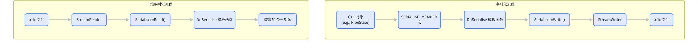

1. **开始 Chunk** : 捕获代码调用 `ser.BeginChunk(VulkanChunk::vkCmdDraw, ...)`。
2. **序列化** **参数** : 接着，通过一系列 `ser.Serialise("paramName", paramValue)` 的调用，将 `cmd` 句柄、`12`、`1` 等参数写入 Chunk。`Serialise` 是一个重载的模板函数，能处理各种 C++ 类型。
3. **DoSerialise** : `Serialise` 内部会调用 `DoSerialise` 模板特化函数。对于基本类型，它直接写入字节；对于结构体，它会递归地调用 `Serialise` 来处理其每个成员。
4. **写入流** : 最终，所有数据都通过 `StreamWriter` 写入到文件流中，并可能经过压缩（如 Zstd）。

```C++
// renderdoc/renderdoc/replay/capture_file.cpp:488-490

WriteSerialiser ser(writer, Ownership::Nothing);

ser.WriteStructuredFile(*file, exportProgress);
```

在需要将内存中的 `SDFile` 对象（它包含了所有 `SDChunk`）写入文件时，`WriteSerialiser::WriteStructuredFile` 会遍历所有 Chunk 和 Object，将它们重新编码为二进制流。

反序列化是完全相反的过程：`ReadSerialiser` 从 `StreamReader` 读取数据，`DoSerialise` 负责从字节流中填充 C++ 对象，`SDObject` 则可以被动态地创建出来，即使在编译时不知道其具体类型。

通过这套设计，RenderDoc 实现了一个既高效又极具扩展性的数据记录系统。它不仅满足了图形调试中海量数据的存储需求，其自描述的特性也为后续的分析工具（如 Python API）提供了极大的便利，使得程序化地访问和解析捕获数据成为可能。

## Overlay 体系与 Depth Test

Overlay（覆盖图）是 RenderDoc 中最直观、最强大的调试功能之一。它允许开发者在原始渲染结果之上，叠加一层额外的可视化信息，以诊断各种渲染问题，如错误的深度测试、不合理的模型复杂度或无效的剔除状态。本章将深入探讨 RenderDoc 的 Overlay 体系，重点关注其核心枚举 `DebugOverlay`、跨后端驱动的实现 `RenderOverlay`，以及深度测试（Depth Test）覆盖图的生成原理。

### DebugOverlay 枚举：定义可视化的类型

所有 Overlay 的类型都定义在 `renderdoc/api/replay/replay_enums.h` 的 `DebugOverlay` 枚举中。这是一个核心枚举，它告诉重放驱动（Replay Driver）应该生成哪种类型的覆盖图。其定义如下：

```C++
// renderdoc/renderdoc/api/replay/replay_enums.h:1539-1556
enum class DebugOverlay : uint32_t
{
  NoOverlay = 0,
  Drawcall,   
  Wireframe,  
  Depth,  
  Stencil,  
  BackfaceCull,   
  ViewportScissor,  
  NaN,  
  Clipping,   
  ClearBeforePass,  
  ClearBeforeDraw,  
  QuadOverdrawPass, 
  QuadOverdrawDraw, 
  TriangleSizePass, 
  TriangleSizeDraw, 
  Count,  
};
```

这个枚举清晰地列出了所有支持的覆盖图类型，包括：

- `NoOverlay`：不显示任何覆盖图。
- `Drawcall`：用不同颜色高亮显示每个 Draw Call 的范围。
- `Wireframe`：以线框模式渲染场景。
- `Depth`：将深度缓冲区的内容可视化为灰度图。
- `Stencil`：将模板缓冲区的内容可视化。
- `QuadOverdraw`：通过颜色强度显示像素被绘制的次数，用于诊断渲染性能。
- `TriangleSize`：根据三角形在屏幕空间的大小为其着色，用于评估模型 LOD 的合理性。

### Overlay 的生成路径：从 ReplayOutput 到 IReplayDriver

当用户在 UI 上选择一个 Overlay 类型时，其请求会通过 `ReplayController` 传递给 `ReplayOutput`。`ReplayOutput` 负责管理渲染输出，包括最终呈现的图像。它在其 `RefreshOverlay` 方法中调用 `IReplayDriver::RenderOverlay` 来生成覆盖图纹理。

`ReplayOutput::RefreshOverlay` 的调用逻辑大致如下：

```C++
// renderdoc/renderdoc/replay/replay_output.cpp:328-333
if(m_pDevice->IsReplayPaused())
{
    // ...
    m_pDevice->ReplayLog(m_Frame, m_StartEvent, m_EndEvent, eReplay_WithoutDraw);

    m_pDevice->RenderOverlay(m_pDevice->GetLiveID(m_OutputTexture.id), m_Overlay, m_EventId, m_Subresources);

    m_pDevice->ReplayLog(m_Frame, m_StartEvent, m_EndEvent, eReplay_OnlyDraw);
}
```

这里的 `m_pDevice` 是一个 `IReplayDriver` 实例。这段代码的精髓在于它将渲染过程分为了两部分：`eReplay_WithoutDraw` 仅重放状态变更（绑定管线、资源等），但不执行实际的 Draw Call；然后调用 `RenderOverlay` 生成覆盖图；最后 `eReplay_OnlyDraw` 仅执行 Draw Call。这确保了 `RenderOverlay` 能在一个确定的、与特定事件对应的管线状态下工作。

下图展示了 Overlay 相关类的交互关系：

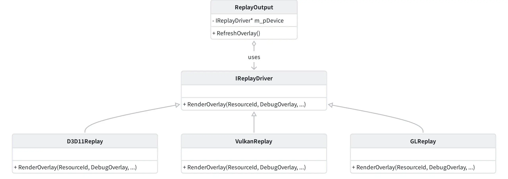

### 跨后端实现：以 D3D11 和 Vulkan 为例

`IReplayDriver::RenderOverlay` 是一个虚函数，每个图形 API 的后端（D3D11, D3D12, Vulkan, OpenGL）都必须提供自己的实现。这些实现通常位于 `driver/<api>/<api>_overlay.cpp` 文件中。

#### D3D11 的 Depth Overlay 实现

在 `renderdoc/driver/d3d11/d3d11_overlay.cpp` 中，`D3D11Replay::RenderOverlay` 方法会根据传入的 `DebugOverlay` 枚举值选择不同的着色器和渲染状态来生成覆盖图。对于 `DebugOverlay::Depth`，它会执行以下操作：

1. **创建临时资源** : 创建一个与目标纹理格式兼容的临时渲染目标（Render Target）。
2. **绑定** **着色器** : 绑定一个特殊的像素着色器，该着色器从深度缓冲区采样，并将深度值转换为颜色。
3. **重放绘制** : 重新播放从当前帧开始到指定 `EventID` 的所有 Draw Call。

```C++
// renderdoc/renderdoc/driver/d3d11/d3d11_overlay.cpp:440-449
if(overlay == DebugOverlay::Depth)
{
  if(dsv)
  {
    // ...
    D3D11_DEPTH_STENCIL_VIEW_DESC dsvDesc;
    dsv->GetDesc(&dsvDesc);

    // ... create temporary resources

    // replay the events
    m_pImmediateContext->OMSetRenderTargets(1, &rtv, dsv);
    // ...
  }
}
```

#### Vulkan 的 Depth Overlay 实现

Vulkan 的实现位于 `renderdoc/driver/vulkan/vk_overlay.cpp`。由于 Vulkan 的管线状态对象（Pipeline State Object, PSO）是预编译的，`VulkanReplay::RenderOverlay` 的实现更为复杂。它不能像 D3D11 那样在运行时动态修改着色器，而是需要创建一个全新的、用于渲染 Overlay 的 `VkPipeline`。

对于 `DebugOverlay::Depth`，其流程大致如下：

1. **获取深度附件** : 找到当前 Render Pass 的深度/模板附件。
2. **创建新管线** : 基于原始管线，创建一个新的图形管线。这个新管线会替换掉片元着色器阶段，使用一个专门用于深度可视化的着色器，并可能禁用颜色写入。
3. **重新提交命令** : 在一个新的命令缓冲区中，重新记录从帧开始到目标 `EventID` 的所有命令，但使用新创建的管线来执行 Draw Call。

```C++
// renderdoc/renderdoc/driver/vulkan/vk_overlay.cpp:1175-1185
if(overlay == DebugOverlay::Depth || overlay == DebugOverlay::Stencil)
{
  // ...
  GetDebugManager()->CreateTexRemapPSO(rp, rp_sub, feedback, pipeDetails, ps, vs, gs, tc, te, fs);

  // ...

  remap.copyTex = GetDebugManager()->GetTexDisplay().copyTex;
  remap.outWidth = outWidth;
  remap.outHeight = outHeight;
  remap.type = type;
  // ...
}
```

这段代码展示了 Vulkan 实现的核心：通过 `GetDebugManager()->CreateTexRemapPSO` 创建一个新的管线状态对象，用于将深度/模板纹理的内容“重新映射”为颜色输出。

下图描绘了深度覆盖图的生成过程：

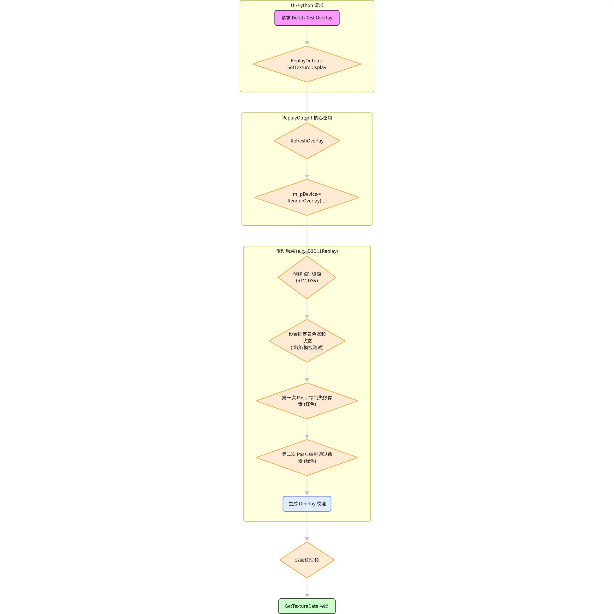

综上所述，RenderDoc 的 Overlay 体系是一个精心设计的分层系统。顶层 API (`IReplayController`) 提供统一接口，中间层 (`ReplayOutput`) 管理状态与调用，底层驱动 (`IReplayDriver`) 则负责针对不同图形 API 的具体实现。这种设计使得添加新的 Overlay 类型或支持新的图形 API 变得相对容易，同时也保证了上层逻辑的纯粹性。

## Python 扩展接口设计与实现

RenderDoc 强大的功能不仅限于其图形用户界面，它还提供了一套丰富的 Python API，允许开发者编写脚本来自动化捕获、分析和调试流程。一个常见的需求是在自动化测试或分析流程中，获取特定事件的调试覆盖图（如深度图、线框图等）。本章将详细设计一个方案，用于在 RenderDoc 的 Python API 中新增一个接口 `GetDepthTestOverlay`，以编程方式获取深度测试（Depth Test）的覆盖图。

### 在 Python 中获取 Depth Test Overlay

我们的目标是实现一个 Python 函数，它能够接受一个事件 ID（`eventId`），并返回该事件发生时的深度测试覆盖图。该函数可以有两种形式：

1. **返回图像字节流** : `bytes = controller.GetDepthTestOverlay(eventId)`
2. **直接保存到文件** : `controller.GetDepthTestOverlay(eventId, "path/to/save.png")`

这将极大地便利自动化测试，例如，可以编写脚本来验证在某个 Draw Call 之后，深度缓冲区的内容是否符合预期。

### 从 C++ 核心到 Python 绑定

要实现这个功能，我们需要在 RenderDoc 的多个层次上进行修改，从核心的 C++ `ReplayController` 到 Python API 的绑定层。下图展示了从 Python 调用到 C++ 实现的完整调用链：

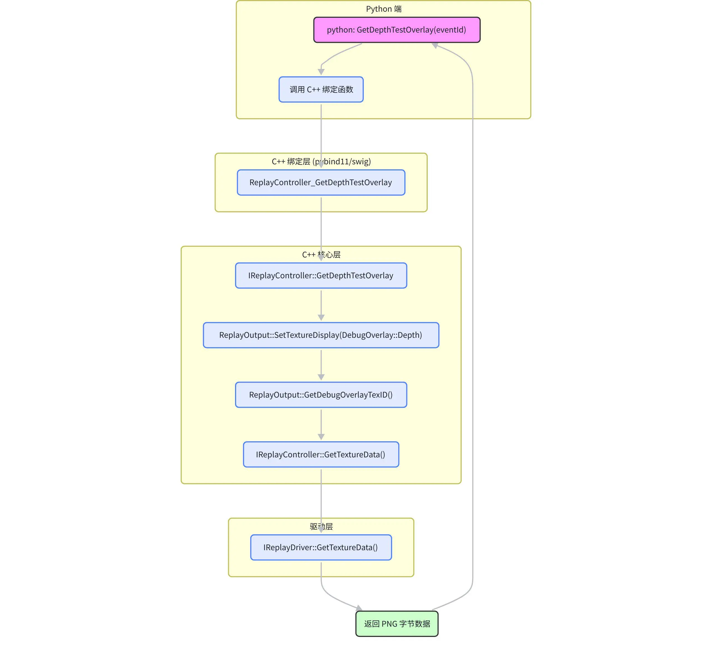

#### 1. C++ 核心层 (`IReplayController`)

首先，我们需要在 `IReplayController` 接口中增加一个新的方法。`IReplayController` 定义在 `renderdoc/api/replay/renderdoc_replay.h`。我们可以复用现有的 Overlay 生成机制，并结合 `GetTextureData` 功能。

一个简洁的方案是扩展 `IReplayOutput` 的功能。`IReplayOutput` 已经有一个 `SetOverlay` 方法，并且能够通过 `GetDebugOverlayTexID` 获取覆盖图的 `ResourceId`。我们可以新增一个方法，直接获取覆盖图的数据。

 **步骤** :

1. 在 `IReplayOutput` 接口中添加一个新方法：

   ```C++
   // 在 renderdoc/api/replay/renderdoc_replay.h 的 IReplayOutput 中
   virtual bytebuf GetOverlayData(ResourceId id, const Subresource &sub, const GetTextureDataParams &params) = 0;
   ```
2. 在 `ReplayOutput` 类（`replay_output.cpp`）中实现这个方法。其内部逻辑将是：a.  调用 `SetOverlay` 设置 `DebugOverlay::Depth`。b.  调用 `RefreshOverlay` 来触发 `IReplayDriver::RenderOverlay` 的执行。c.  获取生成的 Overlay 纹理的 `ResourceId`。d.  调用 `IReplayDriver::GetTextureData` 来获取该纹理的数据。e.  将数据打包成 `bytebuf`（一个动态字节数组）并返回。

#### 2. Replay Driver 层 (`IReplayDriver`)

这一层不需要大的改动，因为 `RenderOverlay` 和 `GetTextureData` 接口已经存在。`RenderOverlay` 负责生成覆盖图纹理，而 `GetTextureData` 负责将 GPU 侧的纹理数据拷贝到 CPU 可读的内存中，并能按需编码为 PNG、JPG 等格式。

`GetTextureData` 的原型如下：

```C++
// renderdoc/renderdoc/replay/replay_driver.h
virtual bool GetTextureData(ResourceId tex, const Subresource &sub, const GetTextureDataParams &params, bytebuf &data) = 0;
```

#### 3. Python 绑定层

RenderDoc 的 Python API 主要通过 SWIG (Simplified Wrapper and Interface Generator) 进行绑定。我们需要修改 `renderdoc/api/python/renderdoc_python.i` 文件，将新的 C++ 接口暴露给 Python。

 **步骤** :

1. 在 `renderdoc_python.i` 中，找到 `IReplayOutput` 的定义部分，并添加新方法的声明。
2. SWIG 会自动生成将 `bytebuf` 转换为 Python `bytes` 对象的代码。
3. 在 `ReplayController` 的 Python 封装类中，添加一个便利函数 `GetDepthTestOverlay`。这个函数会获取或创建一个 `ReplayOutput`，调用其 `GetOverlayData`，并处理参数。

#### 4. 资源生命周期与平台差异

- **资源生命周期** : `RenderOverlay` 生成的纹理是临时的，其生命周期由 `ReplayOutput` 管理。当 `ReplayOutput` 被销毁或下一次 `RefreshOverlay` 被调用时，旧的纹理可能会被释放。我们的 `GetOverlayData` 实现必须确保在 `GetTextureData` 调用完成之前，该纹理是有效的。由于 `GetTextureData` 是一个同步调用，这通常能得到保证。

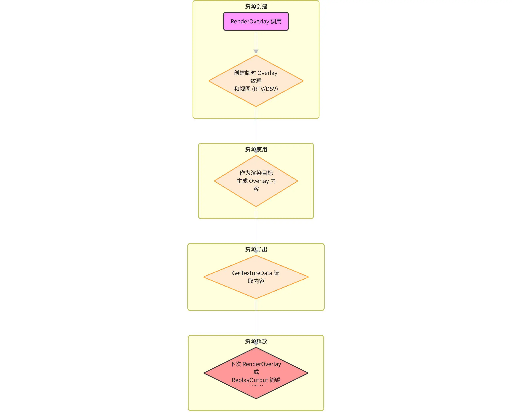

- **平台差异** : `IReplayDriver` 的抽象已经处理了大部分平台差异。`GetTextureData` 的实现在每个后端（D3D11, Vulkan 等）中都会将特定于 API 的纹理资源转换为通用的字节数组。PNG 编码由一个共享的库（如 `stb_image_write`）完成，因此在 Python 层面上，我们能得到一致的 `bytes` 对象。

### Python 使用示例

完成上述修改后，在 Python 脚本中使用新 API 将变得非常简单。以下是一个示例脚本，它加载一个 `.rdc` 文件，并获取第 100 个事件的深度覆盖图，然后将其保存为 PNG 文件。

```Python
import renderdoc as rd

def get_depth_overlay(controller, event_id, save_path):
    """获取指定事件的深度覆盖图并保存"""
  
    # 创建一个临时输出
    output = controller.CreateOutput(rd.NullProgress()) 
  
    # 设置覆盖图类型为深度
    output.SetOverlay(rd.DebugOverlay.Depth, 0.0, 1.0)

    # 设置当前事件，这将触发 RefreshOverlay
    controller.SetFrameEvent(event_id, True)

    # 获取覆盖图的 ResourceId
    tex_id = output.GetDebugOverlayTexID()

    # 获取纹理数据为 PNG 字节
    tex_data = controller.GetTextureData(tex_id, rd.Subresource())

    # 将字节写入文件
    with open(save_path, "wb") as f:
        f.write(tex_data)

    # 销毁输出对象
    output.Shutdown()

# ... 在你的脚本中调用 ...
# controller = ... (获取 ReplayController 实例)
# get_depth_overlay(controller, 100, "depth_overlay_at_event_100.png")
```

这段代码展示了如何利用现有和新增的 API 组合，以一种清晰、线性的方式完成目标。它首先创建一个输出，配置好 Overlay，然后通过 `SetFrameEvent` 定位到目标事件，最后通过 `GetTextureData` 获取结果。这种方式也避免了对 `IReplayController` 接口进行大的改动，具有更好的向后兼容性。

## 编译与调试建议

要对 RenderDoc 进行二次开发或深入研究，首先需要成功地编译其源代码并搭建一个有效的调试环境。RenderDoc 的构建系统基于 CMake，支持跨平台编译（Windows, Linux, macOS, Android）。本章将提供一份实用的编译与调试指引，涵盖依赖项、CMake 配置、最小构建示例以及在开发过程中可能遇到的常见问题。

### 构建系统与依赖项

RenderDoc 使用 CMake 来管理其复杂的构建过程。在开始编译之前，你需要确保安装了以下基本工具和依赖：

- **CMake** : 版本 3.10 或更高。
- **Python3** : 用于执行构建脚本和生成代码。
- **C++编译器** :
  - Windows: Visual Studio 2019 或更高版本，需安装 C++ 桌面开发工作负载。
  - Linux: GCC 9 或 Clang 9 或更高版本。
  - macOS: Xcode 12 或更高版本。
- **Qt 框架** : 如果你需要编译 `qrenderdoc` 图形界面，需要安装 Qt 5.15 或更高版本。

RenderDoc 的许多第三方依赖（如 zstd, stb）都作为子模块包含在 `3rdparty` 目录中，会在首次运行 CMake 时自动处理。

### 编译流程

标准的编译流程遵循 CMake 的 out-of-source build 模式，这有助于保持源代码目录的整洁。下图展示了基本的构建流程：

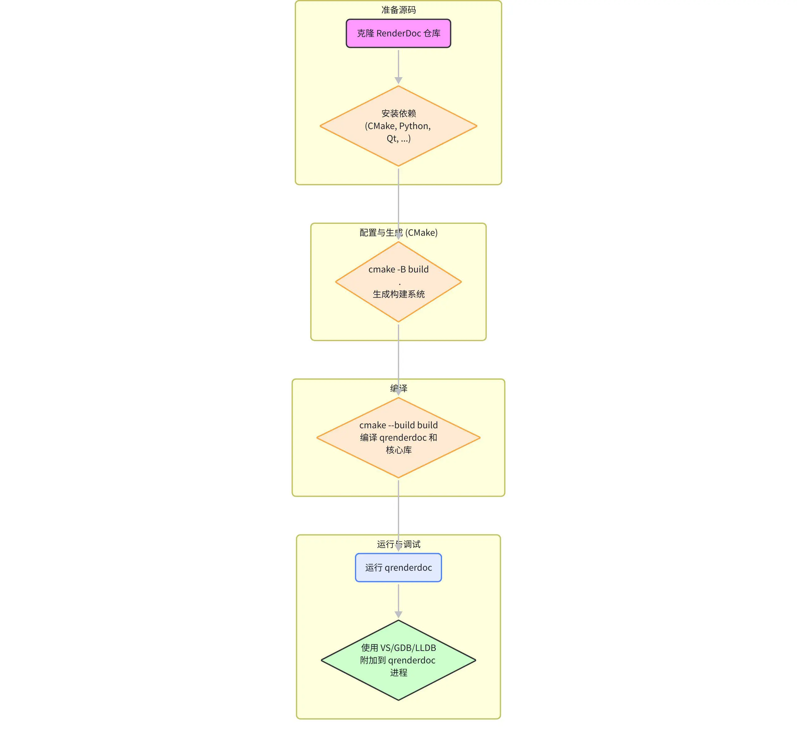

 **步骤** :

1. **克隆仓库** :

```Bash
   git clone --recursive https://github.com/baldurk/renderdoc.git
   cd renderdoc
```

`--recursive` 标志是必需的，它会同时克隆所有的子模块。

1. **运行 CMake 配置** : 创建一个构建目录并从该目录运行 CMake。
2. **Windows (Visual Studio)** :
   `Bash mkdir build cd build cmake .. -G "Visual Studio 16 2019" -A x64`
3. **Linux (Makefiles)** :

   ```Bash
   mkdir build
   cd build
   cmake .. -DCMAKE_BUILD_TYPE=Release
   ```
4. **执行编译** :

   1. **Windows** : 在 Visual Studio 中打开 `build/renderdoc.sln` 解决方案，然后选择 `renderdoc` 或 `qrenderdoc` 项目进行编译。
   2. **Linux** : 在构建目录中运行 `make`。

   ```Bash
   make -j8
   ```

#### 最小构建示例

如果你只对核心的捕获和回放功能感兴趣，而不需要 UI，你可以禁用 Qt 相关的目标，以加快编译速度。

```Bash
camke .. -DBUILD_QRENDERDOC=OFF
```

这将只编译 `renderdoc.dll` (或 `.so`) 核心库和 `renderdoccmd` 命令行工具。

### 调试建议

调试 RenderDoc 分为两个主要场景：调试捕获过程和调试回放过程。

#### 调试捕获过程

调试捕获过程通常比较棘手，因为它涉及到向目标应用程序注入一个 DLL。一个有效的方法是：

1. **设置 Visual Studio/GDB** : 将 `renderdoc.dll` 项目的调试设置配置为“启动外部程序”。将“命令”指向你想要捕获的图形应用程序的可执行文件。
2. **设置环境变量** : 设置 RenderDoc 的环境变量，使其在目标程序启动时自动注入。例如，在 Windows 上，你可以设置 `RENDERDOC_HOOK_EGL=0` 来强制使用 WGL。
3. **附加到进程** : 或者，你可以先启动目标程序，然后从你的 IDE 中选择“附加到进程”，附加到该程序上。之后，在 RenderDoc UI 中触发捕获，断点就会在 `renderdoc.dll` 的代码中被命中。

#### 调试回放过程

调试回放过程相对直接。`qrenderdoc` 是一个很好的宿主程序。

1. **将 `qrenderdoc`设为启动项目** : 在 Visual Studio 中，将 `qrenderdoc` 设为启动项目。
2. **设置命令行参数** : 在项目属性的“调试”页面，将“命令参数”设置为你想要加载的 `.rdc` 文件路径。
3. **设置断点** : 在 `renderdoc` 核心库的代码中（如 `ReplayController::SetFrameEvent` 或 `D3D11Replay::RenderOverlay`）设置断点。
4. **启动调试** : 按 F5 启动调试。当 `qrenderdoc` 加载捕获并进行重放时，你的断点将被命中。

下图是一个通用的调试工作流：

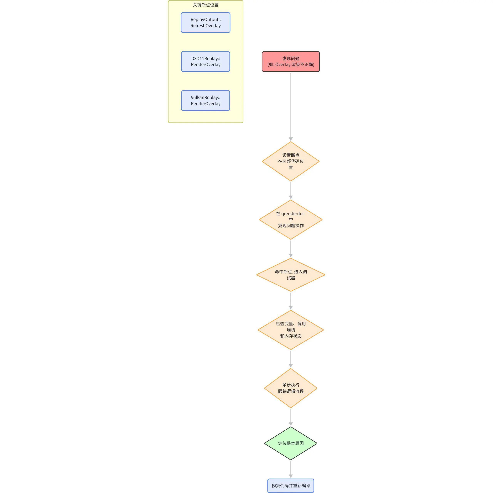

### 常见问题与边界

- **驱动兼容性** : RenderDoc 对图形驱动的版本有一定要求。如果遇到无法捕获或重放崩溃的问题，首先应检查 GPU 驱动是否为最新版本。
- **权限问题** : 在某些系统上（尤其是 Linux），捕获可能需要特定的权限。确保运行目标应用的用户有权加载动态链接库。
- **平台差异** : 尽管 RenderDoc 努力提供跨平台一致的体验，但不同操作系统和图形 API 之间仍然存在细微差别。例如，Vulkan 的层（Layer）机制与 D3D11 的代理 DLL（Proxy DLL）注入方式完全不同。在进行底层开发时，必须仔细阅读特定于平台的代码。
- **构建缓存** : 当你修改了 CMakeLists.txt 文件或切换了构建配置后，最好清理构建目录（删除 `build` 文件夹下的所有内容）并重新运行 CMake，以避免因陈旧的缓存而导致的奇怪编译错误。
