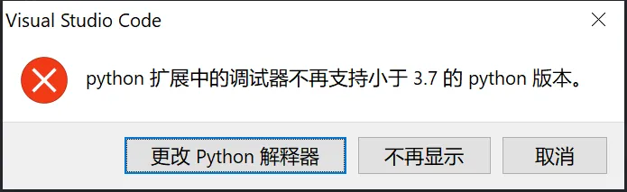
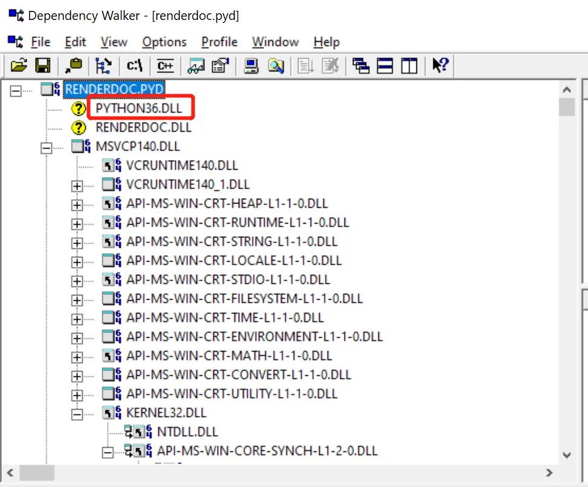
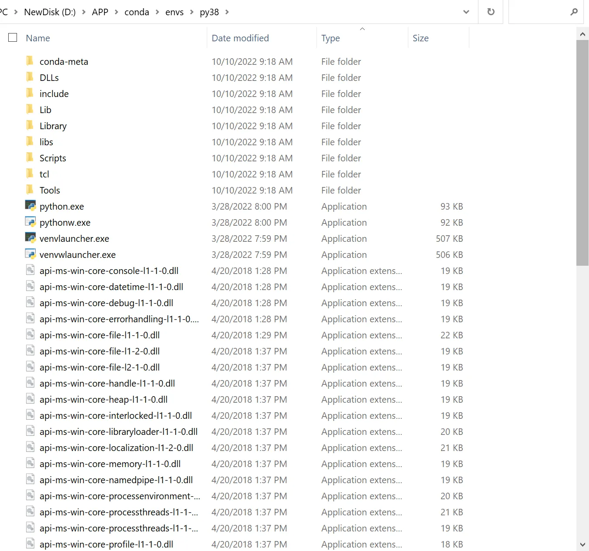
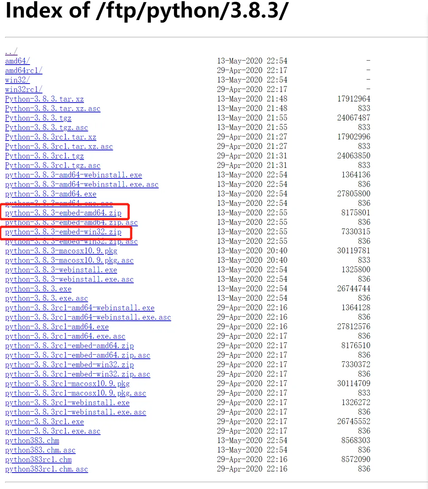
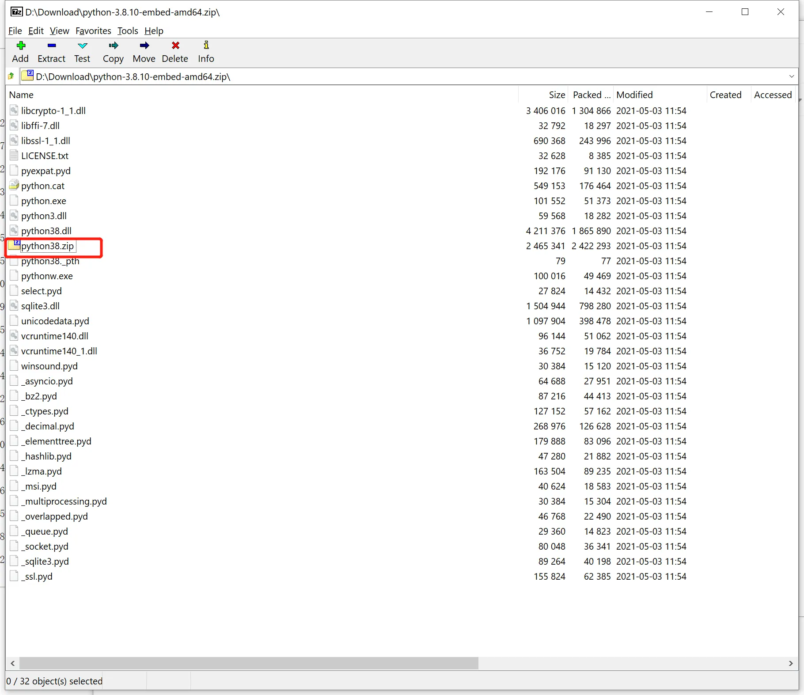
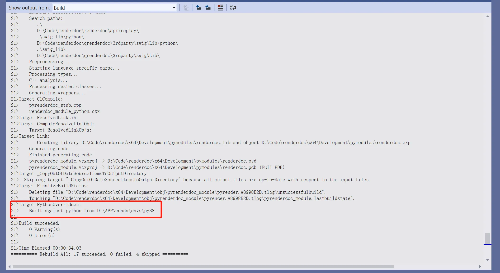
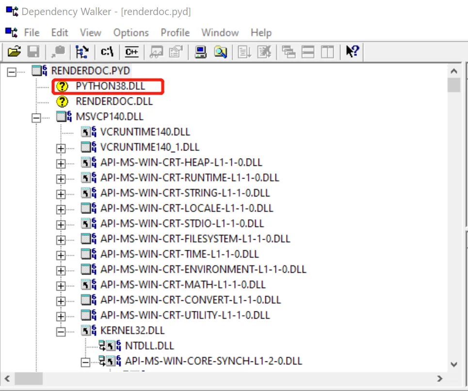
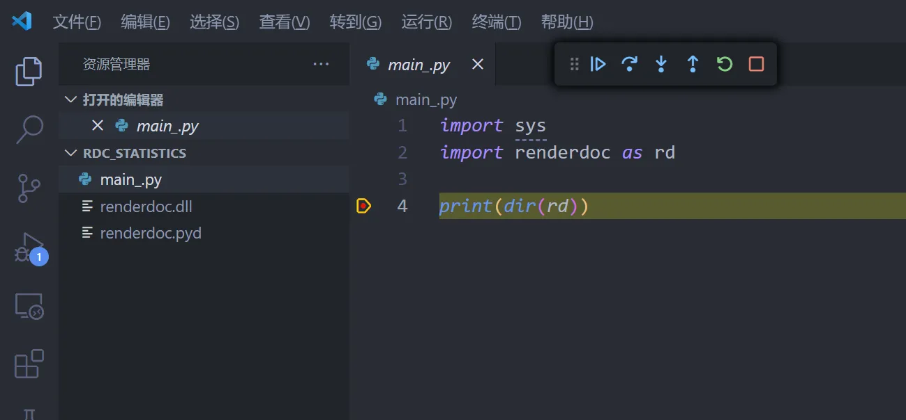

Title: RenderDoc的Python API版本升级
Date: 2023-10-20
Modified: 2025-12-16
Category: RenderDoc
Tags: RenderDoc, Python, VSCode, Debug
Slug: renderdoc-python-update
Author: HaokunZheng
Summary: 给renderdoc做二次开发，调试时候发现python版本过低无法调试？没关系，手把手教你给Renderdoc内嵌的python升级


Renderdoc是一个很常用的图像API调试工具，其一系列的Python API可以方便的让使用者在其之上做一些二次开发。然而Renderdoc内置的Python版本刚好是3.6，作为2016年发布的Python现在已逐渐显得落后，例如类型标注支持不完善、不支持异步编程中的上下文管理以及泛型语法等，且最关键的是VSCode的调试器现已不再支持Python<3.7的版本。



断点调试是改bug的利器，本文就介绍一下升级RenderDoc的Python版本方法，让我们写代码的过程可以优雅的断点调试，还能用上Python的更多新特性。

将RenderDoc源码从[Github仓库](https://github.com/baldurk/renderdoc)克隆到本地，控制Renderdoc Python API编译导出的模块是qrenderdoc_module，位于 `qrenderdoc\Code\pyrenderdoc`下，控制Python版本选择的配置文件是 `python.props`

```xml
<?xml version="1.0" encoding="utf-8"?>
<Project ToolsVersion="4.0" xmlns="http://schemas.microsoft.com/developer/msbuild/2003">

<PropertyGroup>
  <PythonBase>$(SolutionDir)\qrenderdoc\3rdparty\python</PythonBase>

  <CustomPythonUsed>0</CustomPythonUsed>

  <!-- output file of python36.dll, python36.zip, python36.lib etc -->
	<PythonMajorMinor>36</PythonMajorMinor>

	<PythonIncludeDir>$(PythonBase)\include</PythonIncludeDir>
	<PythonImportLib>$(PythonBase)\$(Platform)\python$(PythonMajorMinor).lib</PythonImportLib>
	<PythonStandardLibraryZip>$(PythonBase)\python$(PythonMajorMinor).zip</PythonStandardLibraryZip>
	<PythonDLLsDir>$(PythonBase)\$(Platform)</PythonDLLsDir>
	<PythonInterpDLL>$(PythonBase)\$(Platform)\python$(PythonMajorMinor).dll</PythonInterpDLL>
</PropertyGroup>

<!-- either we have the 'embeddable zip' which has everything in the same folder,
     or we have an install which has things under libs/, include/ and DLLs/
     We also just naively check every PythonMajorMinor.
     NOTE: pythonXY.lib isn't included in the embed zip currently, so you'd have
     to regenerate it from the pythonXY.dll. You also need to include the include/
     folder manually from the python source distribution.
     ALSO: pythonXY.zip isn't included in the installed distribution (it instead
     uses the Lib/ folder with all the loose uncompiled library source).
     It will need to be generated manually or obtained from the embeddable zip.
     As a result we use the existance of the .lib, .h and .zip as a key to
     ensure we only use -->

<!-- MSBuild doesn't implement a simple loop so just do this by hand by
     taking advantage of MSBuild evaluating these in-order.
     First we set the number we're testing, then see if we find the files. If
     we find the files we set CustomPythonUsed which prevents all subsequent checks
     and then at the end we'll pick it up to set all the derived properties.
     To add a new version to check for, copy paste both lines and update the number.
     -->

<!-- first define the override prefix we're searching against -->
<PropertyGroup>
	<PythonOverride Condition="'$(Platform)'=='Win32'">$(RENDERDOC_PYTHON_PREFIX32)</PythonOverride>
	<PythonOverride Condition="'$(Platform)'=='x64'">$(RENDERDOC_PYTHON_PREFIX64)</PythonOverride>
</PropertyGroup>

<PropertyGroup><PythonMajorMinorTest>39</PythonMajorMinorTest></PropertyGroup>
<PropertyGroup Condition="'$(CustomPythonUsed)'=='0' AND Exists('$(PythonOverride)\include\Python.h') AND Exists('$(PythonOverride)\python$(PythonMajorMinorTest).zip') AND (Exists('$(PythonOverride)\python$(PythonMajorMinorTest).lib') OR Exists('$(PythonOverride)\libs\python$(PythonMajorMinorTest).lib'))"><CustomPythonUsed>$(PythonMajorMinorTest)</CustomPythonUsed></PropertyGroup>

<PropertyGroup><PythonMajorMinorTest>38</PythonMajorMinorTest></PropertyGroup>
<PropertyGroup Condition="'$(CustomPythonUsed)'=='0' AND Exists('$(PythonOverride)\include\Python.h') AND Exists('$(PythonOverride)\python$(PythonMajorMinorTest).zip') AND (Exists('$(PythonOverride)\python$(PythonMajorMinorTest).lib') OR Exists('$(PythonOverride)\libs\python$(PythonMajorMinorTest).lib'))"><CustomPythonUsed>$(PythonMajorMinorTest)</CustomPythonUsed></PropertyGroup>

<PropertyGroup><PythonMajorMinorTest>37</PythonMajorMinorTest></PropertyGroup>
<PropertyGroup Condition="'$(CustomPythonUsed)'=='0' AND Exists('$(PythonOverride)\include\Python.h') AND Exists('$(PythonOverride)\python$(PythonMajorMinorTest).zip') AND (Exists('$(PythonOverride)\python$(PythonMajorMinorTest).lib') OR Exists('$(PythonOverride)\libs\python$(PythonMajorMinorTest).lib'))"><CustomPythonUsed>$(PythonMajorMinorTest)</CustomPythonUsed></PropertyGroup>

<PropertyGroup><PythonMajorMinorTest>36</PythonMajorMinorTest></PropertyGroup>
<PropertyGroup Condition="'$(CustomPythonUsed)'=='0' AND Exists('$(PythonOverride)\include\Python.h') AND Exists('$(PythonOverride)\python$(PythonMajorMinorTest).zip') AND (Exists('$(PythonOverride)\python$(PythonMajorMinorTest).lib') OR Exists('$(PythonOverride)\libs\python$(PythonMajorMinorTest).lib'))"><CustomPythonUsed>$(PythonMajorMinorTest)</CustomPythonUsed></PropertyGroup>

<PropertyGroup><PythonMajorMinorTest>35</PythonMajorMinorTest></PropertyGroup>
<PropertyGroup Condition="'$(CustomPythonUsed)'=='0' AND Exists('$(PythonOverride)\include\Python.h') AND Exists('$(PythonOverride)\python$(PythonMajorMinorTest).zip') AND (Exists('$(PythonOverride)\python$(PythonMajorMinorTest).lib') OR Exists('$(PythonOverride)\libs\python$(PythonMajorMinorTest).lib'))"><CustomPythonUsed>$(PythonMajorMinorTest)</CustomPythonUsed></PropertyGroup>

<PropertyGroup><PythonMajorMinorTest>34</PythonMajorMinorTest></PropertyGroup>
<PropertyGroup Condition="'$(CustomPythonUsed)'=='0' AND Exists('$(PythonOverride)\include\Python.h') AND Exists('$(PythonOverride)\python$(PythonMajorMinorTest).zip') AND (Exists('$(PythonOverride)\python$(PythonMajorMinorTest).lib') OR Exists('$(PythonOverride)\libs\python$(PythonMajorMinorTest).lib'))"><CustomPythonUsed>$(PythonMajorMinorTest)</CustomPythonUsed></PropertyGroup>

<PropertyGroup Condition="'$(CustomPythonUsed)'!='0'">
  <PythonBase>$(PythonOverride)</PythonBase>

	<PythonMajorMinor>$(CustomPythonUsed)</PythonMajorMinor>

  <!-- these are always in the root, regardless of the installation type -->
	<PythonIncludeDir>$(PythonBase)\include</PythonIncludeDir>
	<PythonStandardLibraryZip>$(PythonBase)\python$(PythonMajorMinor).zip</PythonStandardLibraryZip>
	<PythonInterpDLL>$(PythonBase)\python$(PythonMajorMinor).dll</PythonInterpDLL>

  <!-- for embeddable zip, find these in the root. Otherwise find these in subfolders -->
	<PythonDLLsDir Condition="Exists('$(PythonOverride)\_ctypes.pyd')">$(PythonBase)</PythonDLLsDir>
	<PythonDLLsDir Condition="Exists('$(PythonOverride)\DLLs\_ctypes.pyd')">$(PythonBase)\DLLs</PythonDLLsDir>
	<PythonImportLib Condition="Exists('$(PythonOverride)\python$(PythonMajorMinor).lib')">$(PythonBase)\python$(PythonMajorMinor).lib</PythonImportLib>
	<PythonImportLib Condition="Exists('$(PythonOverride)\libs\python$(PythonMajorMinor).lib')">$(PythonBase)\libs\python$(PythonMajorMinor).lib</PythonImportLib>
</PropertyGroup>

<Target Name="PythonOverridden" AfterTargets="Build" Condition="'$(CustomPythonUsed)'!='0'">
	<Message Importance="high" Text="Built against python from $(PythonOverride)" />
</Target>

</Project>
```

这个配置文件的逻辑是先设定一个默认的Python路径，位于项目的路径之下：`$(SolutionDir)\qrenderdoc\3rdparty\python`，然后再根据编译平台是64位还是32位去环境变量 `$(RENDERDOC_PYTHON_PREFIX64)`或者 `$(RENDERDOC_PYTHON_PREFIX32)`指向的路径下搜索，如果路径下存在 `include\Python.h`、`pythonXX.zip`与 `libs\pythonXX.lib`就会使用这个路径之下的Python取代默认的。

先编译一下RenderDoc，使用Dependency Walker检测编译出来的Python Module： `x64\Development\pymodulesrenderdoc.pyd`



可以看到使用的就是项目自带的Python3.6

这时候可以通过配置环境变量或者直接hard code一下配置文件：

```xml
<PropertyGroup>
	<PythonOverride Condition="'$(Platform)'=='Win32'">$(RENDERDOC_PYTHON_PREFIX32)</PythonOverride>
	<PythonOverride Condition="'$(Platform)'=='x64'">D:\APP\conda\envs\py38</PythonOverride>
</PropertyGroup>
```

此处我使用自己用Anaconda安装的python3.8，但检查一下该路径下并不存在 `python38.zip`，是因为这个zip只存在与Embeddable版本的python安装包中，这是一个小体积的专门将Python嵌入到另一个应用程序中的安装包。



所以还需要自己去[Python官网](https://www.python.org/ftp/python/)下载一下，文件名中带有“embed”的就是。





下载完成之后将其内部的zip文件放入上述路径下，启动编译即可。

编译log末尾会显示成功检测到指定路径下python的信息，



再用Dependence Walkers查看pyd文件，可见已经是python3.8。



写Renderdoc脚本时将相关的dll放到工作路径之下，或者用sys.path.append添加pyd所在的路径，此时再打开VSCode，选好对应的Python，就可以愉快的断点调试了：


