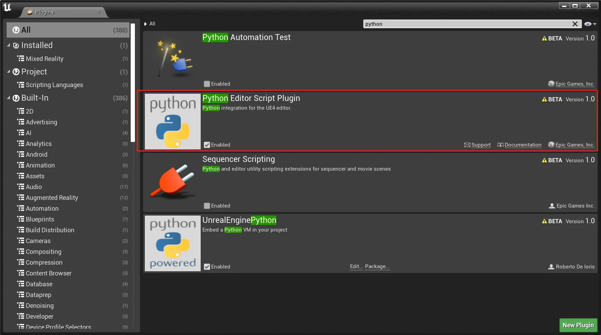
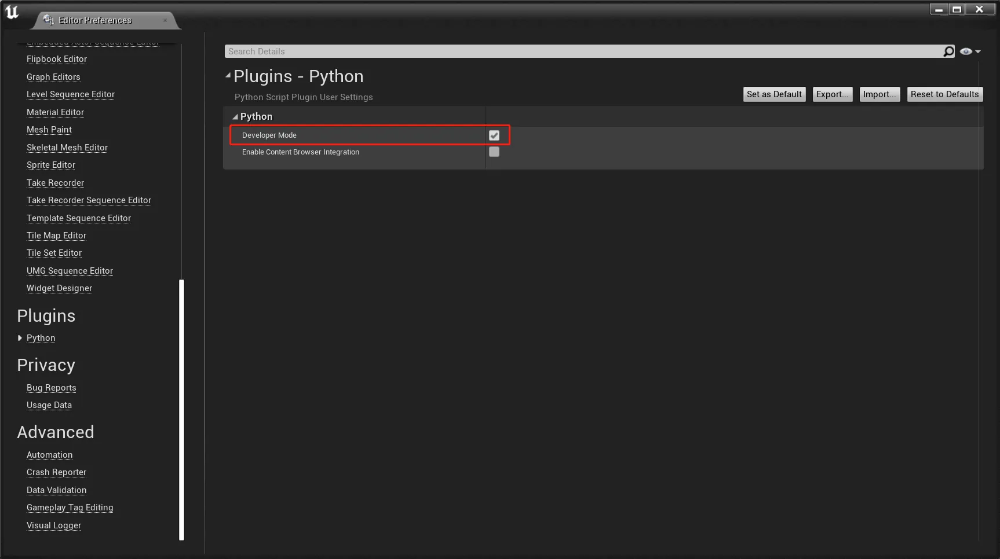
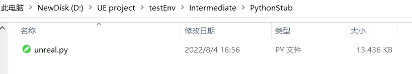
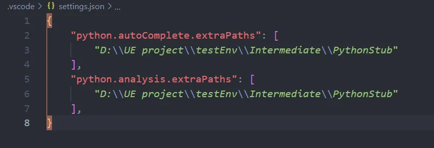
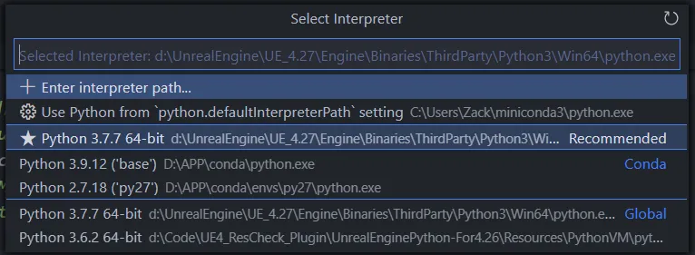
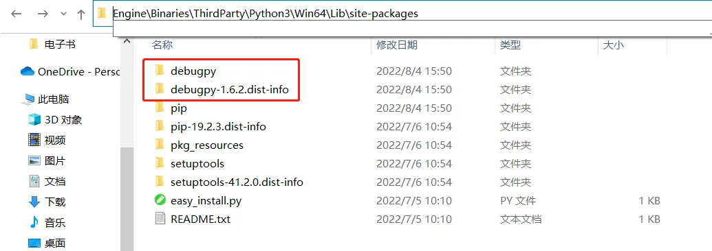
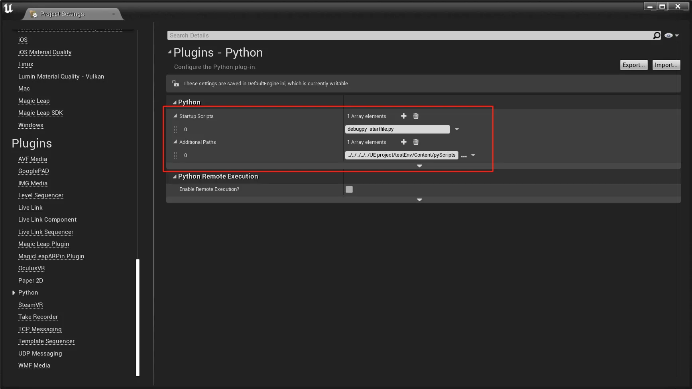
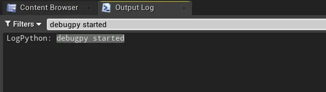
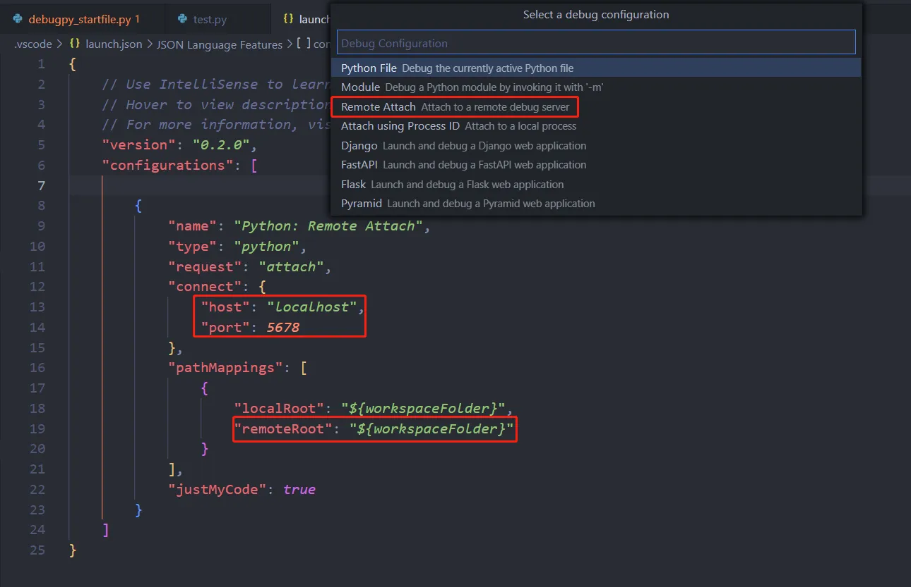
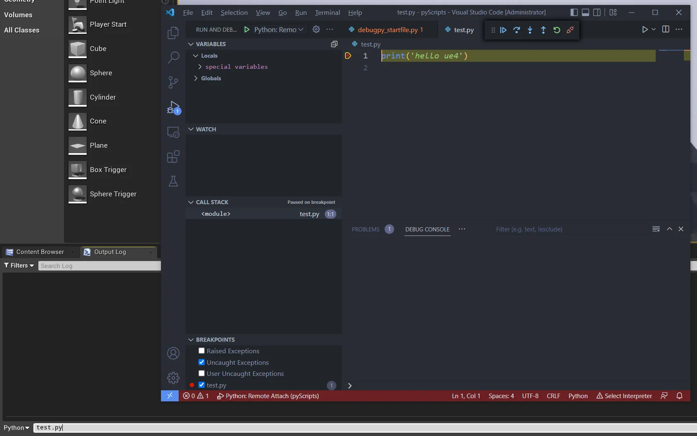

Title: UE的Python Editor Script Plugin代码提示补全与断点调试配置方法——以VSCode为例
Date: 2022-08-03
Modified: 2025-12-16
Category: UnrealEngine
Tags: UnrealEngine, Python, VSCode, Debug
Slug: ue-vscode-python-debug
Author: HaokunZheng
Summary: 本文总结了一种在UnrealEngine中使用vscode编写python时配置代码补全和断点调试的方法
Lang: cn

# 前言

**近年来越来越流行使用Python语言来进行程序的二次开发，实现具体业务针对性功能拓展，Python官方也为将Python解释器嵌入更大的应用程序中提供了详细的说明**[文档](https://docs.python.org/zh-cn/3.7/extending/index.html)。

**对Unreal Engine来说，第三方的**[UnrealEnginePython](https://github.com/20tab/UnrealEnginePython)（UEP）从UE4.12开始为UE项目以插件的形式嵌入了一个完整的Python虚拟机，并提供Python的接口来访问UE的内部api与反射系统。但随着Epic在2018推出了官方的[Unreal Python API](https://docs.unrealengine.com/5.0/zh-CN/scripting-the-unreal-editor-using-python/)（Python Editor Script Plugin）UEP逐渐停止了维护，随着UE的迭代升级出现了许多不兼容的问题，所以目前基于Unreal的python开发还是推荐使用官方的插件。

**UE4.26开始内建Python3.7.7，UE5则是升级到了Python3.9.7。可以在Unreal Editor -- Edit -- plugin中勾选启用。**



# 开发环境准备

**工欲善其事，必先利其器。Python虽然内建在应用程序中，但运行的主体还是应用程序本身，只是某些部分偶尔会调用 Python 解释器来运行一些 Python 代码，这就给开发调试带了了一些困难。本部分介绍一种解决方法：通过**[debugpy](https://github.com/microsoft/debugpy/)配合vscode实现代码的开发与调试。

## 1. 配置代码提示补全

**第一步，在Unreal Editor -- Edit -- Editor preference中勾选Python插件的Developer Mode，此时在项目路径下就会出现** `<span class="ne-text">(ProjectDirectory)/Intermediate/PythonStub/unreal.py</span>`文件。





**第二步，将这个路径添加到** `<span class="ne-text">settings.json</span>`当中就能实现代码自动补全了。



**第三步（可选），设置python解释器路径：在vscode中按下** `<span class="ne-text">ctrl+p</span>`在跳出的命令框中输入 `<span class="ne-text">Python: Select Interpreter</span>`回车后选择 `<span class="ne-text">(EngineDirectory)/Engine/Binaries/ThirdParty/Python3/Win64/python.exe</span>`为当前workspace的解释器。



**使用其他默认的python解释器也不是不行，但可能会因为python版本不一致造成语法提示不对写出奇怪的bug。**

## 2. 安装debugpy

**在** `<span class="ne-text">(EngineDirectory)/Engine/Binaries/ThirdParty/Python3/Win64</span>`中运行命令 `<span class="ne-text">./python -m pip install debugpy</span>`，安装成功后就能在 `<span class="ne-text">(EngineDirectory)/Engine/Binaries/ThirdParty/Python3/Win64/Lib/site-packages</span>`中看到。



## 3. 添加启动脚本

**第一步，在项目下新建一个启用debugpy的脚本：**

```python
import debugpy
debugpy.configure(python="D:\\UnrealEngine\\UE_4.27\\Engine\\Binaries\\ThirdParty\\Python3\\Win64\\python.exe")
debugpy.listen(("localhost", 5678))
# debugpy.wait_for_client() # blocks execution until client is attached
print("debugpy started")
```

 **注意：** **debugpy默认会拉起sys.executable指示的程序用于debug，由于我们使用的Python是嵌入在UE当中的，所以sys.executable指示的是UE4Editor.exe，这会导致socket连接超时的错误。所以需要使用debugpy.configure配置一下，让其去启动嵌入在UE中的Python。**

**第二步，选择** 编辑（Edit）-- 项目设置...（Project Settings...）。在 插件（Plugins） 列表下，选择 Python。然后，将脚本添加到 启动脚本（Startup scripts） 设置中：



**重启Editor之后看到终端中输出了print语句的内容，表示启动脚本运行正常。**



## 4. 开始调试吧

**在vscode当中配置Remote Attach的ip与端口号，且** `remoteRoot`设置为 `${workspaceFolder}`：



**先在vscode中打好断点并按下F5开始debug，然后回到unreal editor当中运行待调试文件，可以看到顺利的停在了断点上面：**



# 参考资料

* [扩展和嵌入 Python 解释器](https://docs.python.org/zh-cn/3.7/extending/index.html)
* [Python debugging in VS Code](https://code.visualstudio.com/docs/python/debugging)
* [为编辑器Python脚本设置自动完成](https://docs.unrealengine.com/4.27/zh-CN/ProductionPipelines/ScriptingAndAutomation/Python/Autocomplete/)
