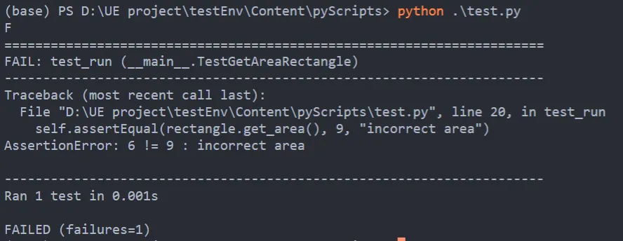
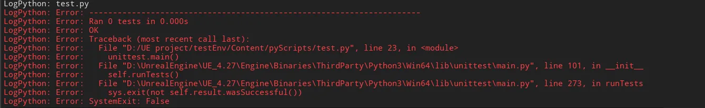
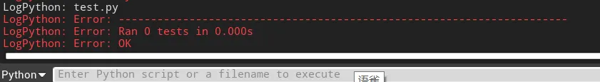
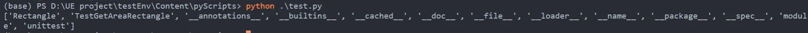
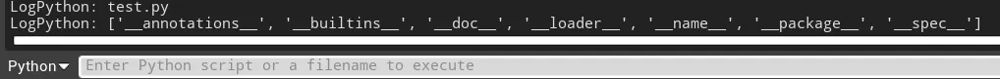
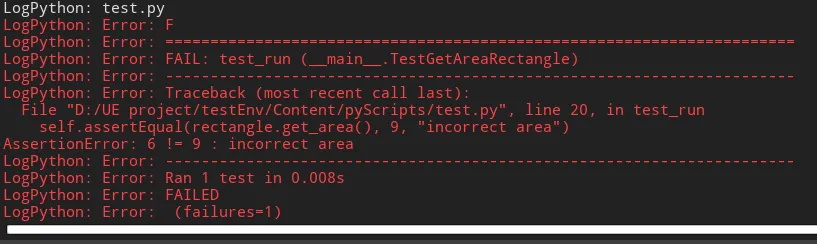
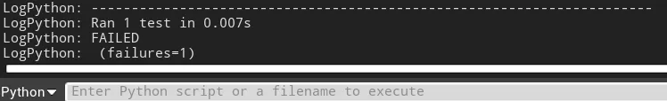

Title: 在UE的Python Editor Script Plugin使用unittest
Date: 2022-09-05
Modified: 2025-12-16
Category: UnrealEngine
Tags: UnrealEngine, Python, VSCode, unittest
Slug: ue-vscode-python-unittest
Author: HaokunZheng
Summary: 本文介绍了一种在UnrealEngine中使用vscode编写python时使用unittest进行单元测试的方法

总所周知编写单元测试是一个良好的习惯，它有保证代码正确性，验证代码是与设计相符合的；减少bug出现的概率，发现设计和需求中存在的错误；方便代码重构，找到在编码过程中引入的错误等等好处。Embedded Python环境与本地Python有许多不同，但当我尝试在UE中写单测时就遇到了奇怪的毛病。

UE中Embeded Python环境与常规本地Python有着许多的不同，比如由于这类原因许多Python自带的库都会出现问题**，**[unittest](https://docs.python.org/3/library/unittest.html)就是其中之一，本文总结一下我在开发过程中的在unittest上踩的坑与解决方式。

首先，写一个普通得不能再普通的单测：

```python
import unittest

class Rectangle: 
    def __init__(self, width, height): 
        self.width = width 
        self.height = height

    def get_area(self):
        return self.width * self.height

    def set_width(self, width):
        self.width = width

    def set_height(self, height):
        self.height = height

class TestGetAreaRectangle(unittest.TestCase): 
    def test_run(self): 
        rectangle = Rectangle(2, 3)
        self.assertEqual(rectangle.get_area(), 9, "incorrect area")

if __name__ == '__main__': 
    unittest.main()
```

它在Python解释器中的运行结果：



可当来到了UE编辑器内后：



这一堆红色的Error真是搞人心态，仔细看看可以发现两个问题：

1. unittest尝试调用 `sys.exit`
2. unittest一个测试用例都没找到

问题1是显而易见的，在[UE的Python Editor Script Plugin代码提示补全与断点调试配置方法——以VSCode为例]({filename}/ue-vscode-python-debug.md)一文中有提到 `sys.executable`在UE的Python中指向的是UE编辑器.exe而非Python解释器.exe，当前进程是编辑器是不允许推出的，于是对代码稍加修改，关闭unittest的自动退出：

```python
if __name__ == '__main__': 
    unittest.main(exit=False)
```



在UE编辑器中运行一下，果然问题1解决了，可是unittest还是无法正常的执行测试用例。这就比较麻烦了，只能分析一下源码了，运行 `unittest.main`后的执行逻辑是 `TestProgram.__init__() --> TestProgram.parseArgs() --> TestProgram.createTest()-->TestLoader.loadTestsFromModule()`。在loadTestsFromModule能看到unittest收集测试用例的代码：

```python
tests = []
for name in dir(module):
    obj = getattr(module, name)
    if isinstance(obj, type) and issubclass(obj, case.TestCase):
        tests.append(self.loadTestsFromTestCase(obj))

load_tests = getattr(module, 'load_tests', None)
tests = self.suiteClass(tests)
if load_tests is not None:
    try:
        return load_tests(self, tests, pattern)
    except Exception as e:
        error_case, error_message = _make_failed_load_tests(
            module.__name__, e, self.suiteClass)
        self.errors.append(error_message)
        return error_case
return tests
```

TestLoader会从模块通过dir获取module内的变量、方法和定义的类型列表，检查是否为TestCase实例，并放入tests中。那这个module是什么呢？顺着参数往回找，能看到TestProgram.init()中看到：

```python
def __init__(self, module='__main__', defaultTest=None, argv=None,
             testRunner=None, testLoader=loader.defaultTestLoader,
             exit=True, verbosity=1, failfast=None, catchbreak=None,
             buffer=None, warnings=None, *, tb_locals=False):
    if isinstance(module, str):
        self.module = __import__(module)
        for part in module.split('.')[1:]:
            self.module = getattr(self.module, part)
```

这个module就是__main__，这就逻辑自洽了，默认情况下就是在写TestCase的文件中运行unittest.main()，所以TestLoader就在这里找TestCase。顺着这个思路我尝试在脚本中运行：

```python
if __name__ == '__main__': 
    module = __import__('__main__')
    print(dir(module))
```

在本地python解释器中得到的结果：



在UE编辑器中得到的结果：



啊这，明明定义了两个类，怎么不见了。这个问题的原因我猜测应该是Embeded Python环境的__main__模块不可重入吧，第二次加载就会重新初始化，这一块我也找不到到相关的资料了。

此路不通就换一条路，把TestCase告诉TestLoader

```python
if __name__ == '__main__':
    suite = unittest.TestLoader().loadTestsFromTestCase(TestGetAreaRectangle)
    result = unittest.TextTestRunner().run(suite)
```

在UE编辑器中运行：



正常了，这是因为TextTestRunner中将输出指向了sys.stderr，我们将其改为sys.stdout即可



不管是stdout还是stderr，UE都会自动重定向到编辑器的命令行中。只不过stderr是重定向到 `_Logger(log_error, log_flush)`中，会显示红色。

最后附上完整的代码：

```python
import unittest
import sys

class Rectangle: 
    def __init__(self, width, height): 
        self.width = width 
        self.height = height

    def get_area(self):
        return self.width * self.height

    def set_width(self, width):
        self.width = width

    def set_height(self, height):
        self.height = height

class TestGetAreaRectangle(unittest.TestCase): 
    def test_run(self): 
        rectangle = Rectangle(2, 3)
        self.assertEqual(rectangle.get_area(), 9, "incorrect area")

if __name__ == '__main__':
    suite = unittest.TestLoader().loadTestsFromTestCase(TestGetAreaRectangle)
    result = unittest.TextTestRunner(stream=sys.stdout).run(suite)
```
